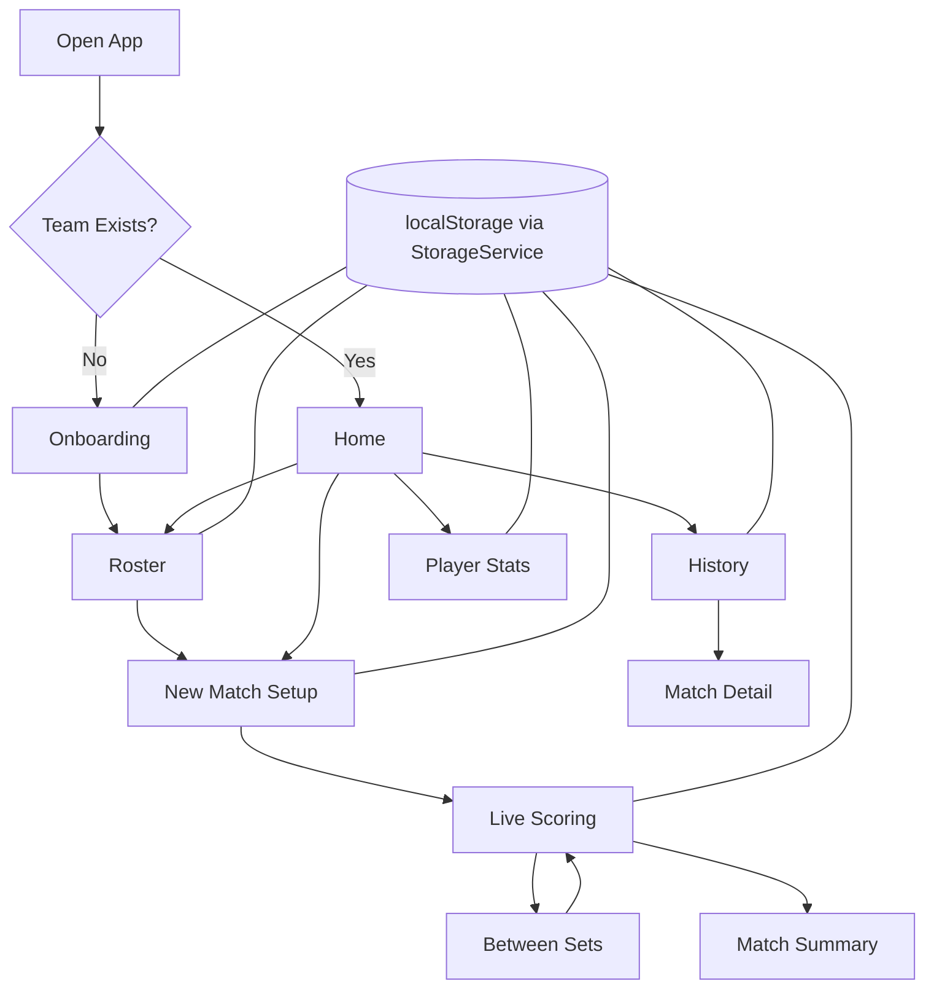

# Volleyball GameStats

Volleyball GameStats is a courtside-first stats tracker for recreational and club volleyball teams. The current repository is a Phase 1 web prototype: a mobile-friendly React app for recording live match stats, reviewing match history, and tracking player performance over time.

It is built to answer one practical question first: can one person reliably track meaningful volleyball stats live, from the sideline, on a phone?

## Why this repo exists

Most volleyball stat tools are either too heavyweight for casual club teams or too limited to be useful during a real match. This project focuses on a narrower problem:

- fast live scoring during a match
- large tap targets for one-handed use
- immediate undo when a stat is entered incorrectly
- simple season history for players and coaches

The prototype is intentionally local-first. There is no backend, no login, and no sync in Phase 1.

## Current prototype status

What is already represented in this repository today:

- onboarding flow for creating a team
- roster management for adding and editing players
- new match setup
- live set-by-set scoring
- per-player stat entry during a live match
- undo support during live stat entry
- match history and match detail views
- player season summary views
- local browser persistence through a storage abstraction
- PWA packaging for installable, home-screen usage
- automated tests with Vitest and Testing Library

What this repository is not yet:

- not a multi-user product
- not backed by an API or database
- not a native mobile app
- not a rules-enforcement engine for substitutions, libero restrictions, or league-specific constraints

## Product shape

### Primary user

A player, captain, or bench teammate tracking stats courtside during a live match.

### Secondary user

A coach or teammate reviewing results and player output after the match.

### Core tracked stats

- kills
- attack errors
- attack attempts
- assists
- aces
- service errors
- digs
- solo blocks
- assisted blocks
- reception errors

Hitting efficiency is treated as a first-class derived stat:

$$
\text{hitting efficiency} = \frac{\text{kills} - \text{attack errors}}{\text{attack attempts}}
$$

## Repository map

```text
.
├── app/                  # Vite + React + TypeScript application
│   ├── public/           # static assets, icons, 404 fallback
│   ├── scripts/          # asset-generation helpers
│   └── src/
│       ├── components/   # reusable UI pieces
│       ├── context/      # storage provider wiring
│       ├── hooks/        # feature logic and state orchestration
│       ├── screens/      # route-level mobile screens
│       ├── storage/      # StorageService interface + localStorage implementation
│       ├── test/         # test setup and mocks
│       ├── types/        # shared app types
│       └── utils/        # stat and summary helpers
├── docs/
│   ├── schema.md         # data model and future SQL direction
│   ├── tdd-workpackages.md
│   └── ui-design.md      # Phase 1 mobile UX direction
├── project-idea.md       # product brief / future direction
└── readme.md             # repo-facing overview
```

## App flow



## Tech stack

- React 19
- TypeScript
- Vite
- React Router
- Tailwind CSS v4
- Vitest + Testing Library
- vite-plugin-pwa
- browser localStorage for persistence in Phase 1

## Technical decisions

### 1. Frontend-only prototype

Phase 1 is deliberately frontend-only. All data lives in the browser so the team can validate the UX before committing to backend complexity.

### 2. Storage abstraction before backend

The app code does not talk directly to `localStorage` from every feature. Instead, it uses a storage service abstraction so Phase 2 can replace local persistence with API-backed storage without rewriting the entire UI.

### 3. Per-set stats model

Stats are stored per player, per set, rather than only as match totals. That keeps match summaries and season aggregates accurate while preserving the structure of a volleyball match.

### 4. PWA instead of native for Phase 1

The current build is installable and works like an app on a phone home screen. That is the cheapest way to test real match-day usage before building a native mobile version.

### 5. Static hosting

The app is built as static assets and deployed to GitHub Pages. That keeps hosting simple, cheap, and aligned with a browser-only prototype.

## Product decisions

These decisions currently shape the prototype:

- indoor volleyball first
- team-focused tracking, not opponent player analytics
- live scoring is the primary workflow
- hitting efficiency must always be easy to access
- record stats, do not enforce league rules
- single team, single device, single recorder in Phase 1

## Future direction

The long-term plan is a Phase 2 mobile product, but the repo is designed so the data model and product decisions survive even if the UI is rebuilt.

### Planned product capabilities

- team accounts and member access
- one designated recorder with others viewing live
- offline-first sync and conflict handling
- cross-platform mobile app
- CSV export for coaches
- better backup and recovery than browser-only storage

### Likely architecture shift in Phase 2

- mobile client separate from backend
- API-backed persistence instead of browser-only storage
- relational schema for teams, players, matches, sets, and player set stats
- authentication plus team invite or team-code flows

The current leaning is to carry forward the data model and UX learnings, not necessarily the full Phase 1 UI codebase.

## Running locally

From the repository root:

```bash
cd app
npm install
npm run dev
```

Then open the local Vite URL shown in the terminal.

Other useful commands:

```bash
cd app
npm run test
npm run test:watch
npm run build
npm run preview
```

## How it is hosted

This repository is configured for GitHub Pages hosting.

- the production build is generated from the app directory
- Vite base path is branch-aware:
	- `main` uses `/volleyball-gamestats/`
	- `dev` uses `/volleyball-gamestats/dev/`
- deployment publishes the built `app/dist` output to the `gh-pages` branch
- a GitHub Actions workflow deploys on pushes to `main` and `dev`

There is also an npm deploy script in the app for manual deployment if needed.

### Environments

- Stable site (main): `https://junaidhossein.github.io/volleyball-gamestats/`
- Daily/dev preview (dev): `https://junaidhossein.github.io/volleyball-gamestats/dev/`

## Static hosting and SSG basics

This project is close to static-site deployment, but it is important to use the right terms.

### Static site hosting

Static hosting means a host serves prebuilt files such as HTML, CSS, JavaScript, images, and a web app manifest. There is no always-on application server generating pages for each request.

That is exactly how this prototype is deployed.

### Static site generator (SSG)

An SSG is a tool that pre-renders pages at build time, usually from templates, routes, markdown content, or CMS data. Typical examples are documentation sites, blogs, and marketing sites.

### What this repo is

This repo is not a classic static site generator project. It is a client-rendered React app that builds to static files.

In practice that means:

- Vite bundles the app into static assets
- GitHub Pages serves those files
- React Router handles navigation in the browser
- browser storage holds the app data

So the deployment model is static, but the application model is a single-page app rather than an SSG-generated site.

## Documentation

If you want to go deeper than the README:

- `project-idea.md` contains the broader product brief and open questions
- `docs/schema.md` documents the current data model and a future SQL shape
- `docs/ui-design.md` captures the Phase 1 mobile-first UX direction

## Suggested document split

The existing markdown files are useful, but they are serving the same purpose today. A cleaner structure is:

- `README.md` for current repo status, setup, hosting, and technical summary
- `project-idea.md` for product vision, future roadmap, and open questions
- `docs/` for deeper implementation references

That split keeps the repository approachable for a new reader without losing the long-term thinking behind the project.